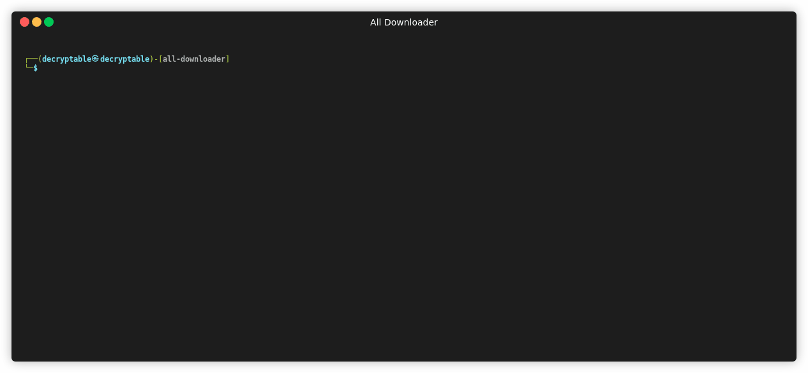

[](https://www.npmjs.com/package/all-downloader)
[](https://github.com/decryptable/all-downloader/issues)
[](https://github.com/decryptable/all-downloader/actions/workflows/publish.yaml)


A simple library for downloading video metadata from various popular platforms such as YouTube, Instagram, Facebook, TikTok, and Vimeo using the SnapDownloader API.

---

## Features

- Supports a wide range of video platforms
- Built with TypeScript and supports full type definitions
- Compatible with ESM, CommonJS, and IIFE module formats
- Includes auto-generated API documentation via GitHub Pages

---

## Installation

Install via npm or yarn:

```bash
npm install all-downloader
````

or

```bash
yarn add all-downloader
```

or

```bash
bun add all-downloader
```

---

## Usage

### CommonJS (Node.js)

```js
const allDownloader = require("all-downloader");

async function run() {
  const result = await allDownloader.parse("https://www.instagram.com/p/DJo8XJnRr2j/");
  console.log(result);
}

run();
```

### ES Modules / TypeScript

```ts
import { parse } from "all-downloader";

async function run() {
  const result = await parse("https://www.instagram.com/p/DJo8XJnRr2j/");
  console.log(result);
}

run();
```

---

## API Documentation

Detailed API reference is available at:

[https://decryptable.github.io/all-downloader](https://decryptable.github.io/all-downloader)

This documentation is automatically generated using JSDoc.

---

## Scripts

```bash
npm run build     # Build the library using tsup
npm run test      # Run tests using Jest
```
