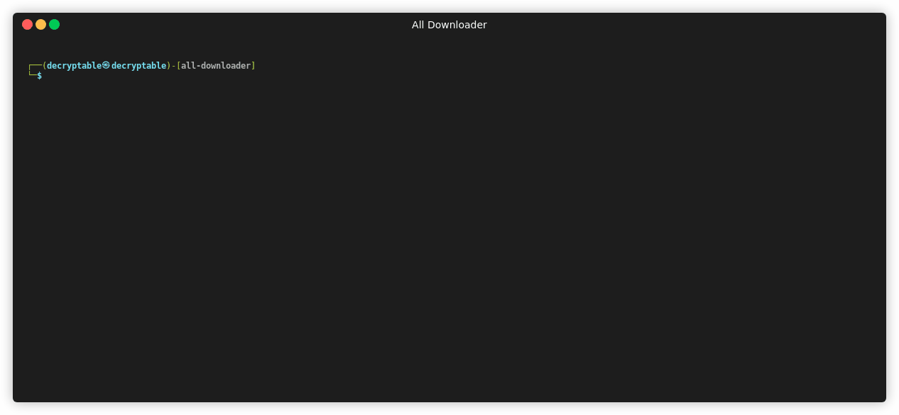

[](https://www.npmjs.com/package/all-downloader)
[](https://github.com/decryptable/all-downloader/issues)
[](https://github.com/decryptable/all-downloader/actions/workflows/publish.yaml)


A simple library for downloading video metadata from various popular platforms such as YouTube, Instagram, Facebook, TikTok, and Vimeo using the SnapDownloader API.

---

## Features

- Supports a wide range of video platforms
- Built with TypeScript and supports full type definitions
- Compatible with ESM, CommonJS, and IIFE module formats
- Includes auto-generated API documentation via GitHub Pages

---

## Supported Sites

|List of Supported sites|
| --- |
| 1tv: Первый канал |
| 20min |
| 220.ro |
| 23video |
| 247sports |
| 24video |
| 3qsdn: 3Q SDN |
| 3sat |
| 56.com |
| 5min |
| 6play |
| 7plus |
| 8tracks |
| 9c9media |
| 9gag |
| 9now.com.au |
| abc.net.au |
| abc.net.au:iview |
| abcnews |
| abcnews:video |
| abcotvs: ABC Owned Television Stations |
| abcotvs:clips |
| AcademicEarth:Course |
| acast |
| acast:channel |
| ADN: Anime Digital Network |
| AdobeConnect |
| adobetv |
| adobetv:channel |
| adobetv:embed |
| adobetv:show |
| adobetv:video |
| AdultSwim |
| aenetworks: A+E Networks: A&amp;E |
| aenetworks:collection |
| aenetworks:show |
| afreecatv: afreecatv.com |
| AirMozilla |
| AliExpress |
| AlJazeera |
| Allocine |
| Amara |
| AMCNetworks |
| AmericasTestKitchen |
| AmericasTestKitchenSeason |
| anderetijden: npo.nl |
| AnimeOnDemand |
| Anvato |
| aol.com: Yahoo screen and movies |
| APA |
| Aparat |
| AppleConnect |
| AppleDaily: 臺灣蘋果日報 |
| ApplePodcasts |
| appletrailers |
| appletrailers:section |
| archive.org: archive.org videos |
| ArcPublishing |
| ARD |
| ARD:mediathek |
| ARDBetaMediathek |
| Arkena |
| arte.sky.it |
| ArteTV |
| ArteTVEmbed |
| ArteTVPlaylist |
| AsianCrush |
| AsianCrushPlaylist |
| AtresPlayer |
| ATTTechChannel |
| ATVAt |
| AudiMedia |
| AudioBoom |
| audiomack |
| audiomack:album |
| AWAAN |
| awaan:live |
| awaan:season |
| awaan:video |
| AZMedien: AZ Medien videos |
| BaiduVideo: 百度视频 |
| bandaichannel |
| Bandcamp |
| Bandcamp:album |
| Bandcamp:weekly |
| bangumi.bilibili.com: BiliBili番剧 |
| bbc: BBC |
| bbc.co.uk: BBC iPlayer |
| bbc.co.uk:article: BBC articles |
| bbc.co.uk:iplayer:episodes |
| bbc.co.uk:iplayer:group |
| bbc.co.uk:playlist |
| BBVTV |
| Beatport |
| Beeg |
| BehindKink |
| Bellator |
| BellMedia |
| Bet |
| bfi:player |
| bfmtv |
| bfmtv:article |
| bfmtv:live |
| BibelTV |
| Bigflix |
| Bild: Bild.de |
| BiliBili |
| BilibiliAudio |
| BilibiliAudioAlbum |
| BiliBiliPlayer |
| BioBioChileTV |
| Biography |
| BIQLE |
| BitChute |
| BitChuteChannel |
| BleacherReport |
| BleacherReportCMS |
| Bloomberg |
| BokeCC |
| BongaCams |
| BostonGlobe |
| Box |
| Bpb: Bundeszentrale für politische Bildung |
| BR: Bayerischer Rundfunk |
| BravoTV |
| Break |
| brightcove:legacy |
| brightcove:new |
| BRMediathek: Bayerischer Rundfunk Mediathek |
| bt:article: Bergens Tidende Articles |
| bt:vestlendingen: Bergens Tidende - Vestlendingen |
| BusinessInsider |
| BuzzFeed |
| BYUtv |
| canalc2.tv |
| Canalplus: mycanal.fr and piwiplus.fr |
| Canvas |
| CanvasEen: canvas.be and een.be |
| CarambaTV |
| CarambaTVPage |
| CartoonNetwork |
| cbc.ca |
| cbc.ca:olympics |
| cbc.ca:player |
| cbc.ca:watch |
| cbc.ca:watch:video |
| CBS |
| CBSInteractive |
| CBSLocal |
| CBSLocalArticle |
| cbsnews: CBS News |
| cbsnews:embed |
| cbsnews:livevideo: CBS News Live Videos |
| cbssports |
| cbssports:embed |
| CCMA |
| CCTV: 央视网 |
| CDA |
| CeskaTelevize |
| CeskaTelevizePorady |
| channel9: Channel 9 |
| CharlieRose |
| Chilloutzone |
| chirbit |
| chirbit:profile |
| cielotv.it |
| Cinchcast |
| Cinemax |
| CiscoLiveSearch |
| CiscoLiveSession |
| CJSW |
| Clippit |
| ClipRs |
| Clipsyndicate |
| CloserToTruth |
| CloudflareStream |
| Cloudy |
| Clubic |
| Clyp |
| cmt.com |
| CNBC |
| CNBCVideo |
| CNN |
| CNNArticle |
| CNNBlogs |
| ComedyCentral |
| ComedyCentralTV |
| Allure |
| Architectural Digest |
| Ars Technica |
| Bon Appétit |
| Brides |
| Condé Nast |
| Condé Nast Traveler |
| Details |
| Epicurious |
| GQ |
| Glamour |
| Golf Digest |
| SELF |
| Teen Vogue |
| The New Yorker |
| Vanity Fair |
| Vogue |
| W Magazine |
| WIRED |
| CONtv |
| Corus |
| Coub |
| Cracked |
| CrooksAndLiars |
| crunchyroll |
| crunchyroll:playlist |
| CSpan: C-SPAN |
| CtsNews: 華視新聞 |
| CTV |
| CTVNews |
| cu.ntv.co.jp: Nippon Television Network |
| Culturebox |
| CultureUnplugged |
| curiositystream |
| curiositystream:collection |
| CWTV |
| DagelijkseKost: dagelijksekost.een.be |
| DailyMail |
| dailymotion |
| dailymotion:playlist |
| dailymotion:user |
| DailyWire |
| daum.net |
| daum.net:clip |
| daum.net:playlist |
| daum.net:user |
| DBTV |
| DctpTv |
| DeezerPlaylist |
| defense.gouv.fr |
| democracynow |
| DHM: Filmarchiv - Deutsches Historisches Museum |
| Digg |
| DigitallySpeaking |
| Digiteka |
| Discovery |
| DiscoveryGo |
| DiscoveryGoPlaylist |
| DiscoveryNetworksDe |
| DiscoveryPlus |
| DiscoveryVR |
| Disney |
| dlive:stream |
| dlive:vod |
| Dotsub |
| DouyuShow |
| DouyuTV: 斗鱼 |
| DPlay |
| DRBonanza |
| Dribbble |
| Dropbox |
| DrTuber |
| drtv |
| drtv:live |
| DTube |
| Dumpert |
| dvtv: http://video.aktualne.cz/ |
| dw |
| dw:article |
| EaglePlatform |
| EbaumsWorld |
| EchoMsk |
| egghead:course: egghead.io course |
| egghead:lesson: egghead.io lesson |
| ehftv |
| eHow |
| EinsUndEinsTV |
| Einthusan |
| eitb.tv |
| EllenTube |
| EllenTubePlaylist |
| EllenTubeVideo |
| ElPais: El País |
| Embedly |
| EMPFlix |
| Engadget |
| EroProfile |
| Escapist |
| ESPN |
| ESPNArticle |
| EsriVideo |
| Europa |
| EWETV |
| ExpoTV |
| Expressen |
| EyedoTV |
| Facebook |
| faz.net |
| fc2 |
| fc2:embed |
| Fczenit |
| FIFA |
| filmon |
| filmon:channel |
| Filmweb |
| FiveThirtyEight |
| FiveTV |
| Flickr |
| Folketinget: Folketinget (ft.dk; Danish parliament) |
| FootyRoom |
| Formula1 |
| FOX |
| FOX9 |
| FOX9News |
| foxnews: Fox News and Fox Business Video |
| foxnews:article |
| FoxSports |
| france2.fr:generation-what |
| FranceCulture |
| FranceInter |
| FranceTV |
| FranceTVEmbed |
| francetvinfo.fr |
| FranceTVJeunesse |
| FranceTVSite |
| Freesound |
| freespeech.org |
| FreeTV |
| FreshLive |
| FrontendMasters |
| FrontendMastersCourse |
| FrontendMastersLesson |
| FujiTVFODPlus7 |
| Funimation |
| Funk |
| Fusion |
| Fux |
| Gaia |
| GameInformer |
| GameSpot |
| GameStar |
| Gaskrank |
| Gazeta |
| GDCVault |
| GediDigital |
| generic: Generic downloader that works on some sites |
| Gfycat |
| GiantBomb |
| Giga |
| GlattvisionTV |
| Glide: Glide mobile video messages (glide.me) |
| Globo |
| GloboArticle |
| Go |
| GodTube |
| Golem |
| GoodGame |
| google:podcasts |
| google:podcasts:feed |
| GoogleDrive |
| GPUTechConf |
| Gronkh |
| Groupon |
| HearThisAt |
| Heise |
| Helsinki: helsinki.fi |
| HentaiStigma |
| hetklokhuis |
| hgtv.com:show |
| HGTVDe |
| HiDive |
| HistoricFilms |
| history:player |
| history:topic: History.com Top |

---

## Installation

Install via npm or yarn:

```bash
npm install all-downloader
````

or

```bash
yarn add all-downloader
```

or

```bash
bun add all-downloader
```

---

## Usage

### CommonJS (Node.js)

```js
const allDownloader = require("all-downloader");

async function run() {
  const result = await allDownloader.parse("https://www.instagram.com/p/DJo8XJnRr2j/");
  console.log(result);
}

run();
```

### ES Modules / TypeScript

```ts
import { parse } from "all-downloader";

async function run() {
  const result = await parse("https://www.instagram.com/p/DJo8XJnRr2j/");
  console.log(result);
}

run();
```

---

## Scripts

```bash
npm run build     # Build the library using tsup
npm run test      # Run tests using Jest
```
